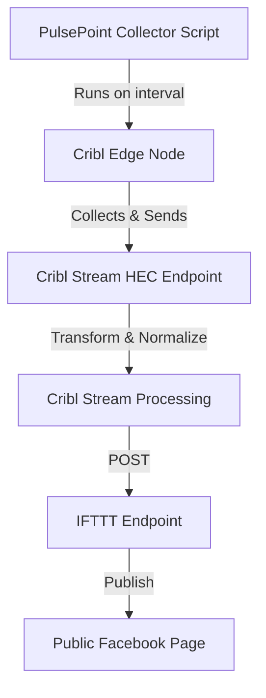

# PulsePoint Data Collection System - Project Plan

## Project Overview

The PulsePoint Data Collection System is designed to collect, process, and forward emergency incident data from the PulsePoint API to various endpoints for further processing and social media integration.

---

## Current Status

- **For detailed, up-to-date feature tracking, see [`feature.md`](./feature.md).**
- **Summary (as of 2024-06-09):**
    - **Completed:** 6 features (e.g., basic metrics, config management, multi-agency support)
    - **In Progress:** 3 features (e.g., enhanced metrics, improved logging, debug logging)
    - **Planned:** 21 features (see `feature.md` for full list and DoD)
- **Recent accomplishments:**
    - Basic metrics collection and Prometheus endpoint
    - YAML-based configuration management
    - Multi-agency support (Iredell, Mecklenburg)
    - Basic error handling and logging

---

## Architecture

---

## Development Phases

1. **Core Functionality**  
   - Basic incident collection, error handling, logging, config, initial metrics

2. **Reliability & Monitoring**  
   - Enhanced error handling, advanced logging, comprehensive metrics, health monitoring, alerting

3. **Performance & Optimization**  
   - Caching, rate limiting, batch processing, resource optimization

4. **Feature Expansion**  
   - Additional agency support, data enrichment, analytics, UI, integrations

---

## Roadmap & Milestones

- **Current focus:**  
  - Enhanced metrics collection  
  - Improved logging  
  - Debug logging capabilities

- **Next up:**  
  - Heartbeat monitoring  
  - Dead-man switch  
  - Advanced metrics  
  - Alert system

- **Longer term:**  
  - Data enrichment (geocoding, weather, traffic)  
  - Performance optimizations  
  - Real-time updates and analytics

---

## Success Criteria

- System uptime > 99.9%
- API response time < 500ms
- Processing time per incident < 1s
- Zero missed active incidents
- < 1% error rate

---

## Documentation

- [Feature Status & Work Tracking](./feature.md)
- API Documentation (TBD)
- Operational Runbooks (TBD)
- Troubleshooting Guides (TBD)
- Configuration Guides (TBD)

---

## Maintenance & Review

- Regularly update `feature.md` as work progresses.
- Periodically review this plan to ensure alignment with project goals and priorities.

---

## Notes

- This plan is a living document and should be updated as the project evolves.
- For granular, actionable work tracking, always refer to `feature.md`.

## Timeline

### Q1 2025
- Core functionality implementation
- Basic metrics collection
- Initial documentation

### Q2 2025
- Reliability improvements
- Enhanced monitoring
- Performance optimization

### Q3 2025
- Feature expansion
- User interface development
- Integration enhancements

### Q4 2025
- System refinement
- Documentation completion
- Production deployment

## Resource Requirements

### Development
- Python development environment
- Access to PulsePoint API
- Cribl Edge node
- Cribl Stream instance
- Testing environment

### Operations
- Production servers
- Monitoring tools
- Backup systems
- Documentation tools

## Risk Management

### Technical Risks
- API changes
- Performance bottlenecks
- Integration challenges
- Data consistency issues

### Mitigation Strategies
- Regular API monitoring
- Performance testing
- Integration testing
- Data validation

## Maintenance

### Regular Tasks
- Log review
- Performance monitoring
- Security updates
- Configuration validation
- Backup verification

### Periodic Tasks
- System updates
- Documentation updates
- Performance optimization
- Security audits
- Capacity planning

## Support

### Technical Support
- Issue tracking
- Bug fixes
- Performance optimization
- Security updates

### User Support
- Documentation
- Training materials
- Best practices
- Troubleshooting guides 