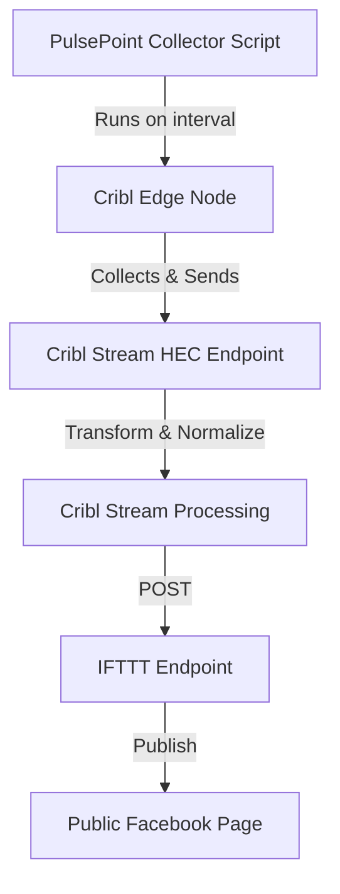

# PulsePoint Data Collection and Publishing System

## Current Architecture

## Current Features
- Active incident collection from PulsePoint API
- Support for multiple agencies (Iredell, Mecklenburg)
- Human-readable incident types and dispatch statuses
- Robust error handling and retry logic
- Detailed logging with debug capabilities
- Efficient processing without unnecessary delays
- Comprehensive metrics collection:
  - API performance metrics
  - Processing duration and rates
  - System resource usage
  - Success/failure tracking
  - Retry attempt monitoring

## Improvement Areas

### 1. Reliability & Monitoring ✅
- [x] Add heartbeat monitoring to ensure script is running
- [x] Implement dead-man switch for failed runs
- [x] Add metrics collection for:
  - Response times from PulsePoint API
  - Processing duration per incident
  - Success/failure rates over time
- [x] Set up alerts for:
  - Script failures
  - API timeouts
  - Unusual incident patterns

### 2. Data Quality & Enrichment
- [ ] Add geocoding validation and enrichment
- [ ] Include weather data for each incident
- [ ] Add cross-reference with traffic data
- [ ] Implement incident deduplication
- [ ] Add historical incident tracking
- [ ] Create incident severity scoring

### 3. Performance Optimization ✅
- [x] Implement caching for repeated API calls
- [x] Add rate limiting for API requests
- [x] Optimize batch processing for multiple incidents
- [x] Implement connection pooling
- [x] Add compression for large payloads

### 4. Feature Enhancements
- [ ] Add support for more agencies
- [ ] Implement incident categorization ML model
- [ ] Add real-time incident updates
- [ ] Create incident heat maps
- [ ] Add response time analytics
- [ ] Implement automated incident summarization

### 5. Security Improvements ✅
- [x] Implement API key rotation
- [x] Add request signing
- [x] Implement IP whitelisting
- [x] Add audit logging
- [x] Implement sensitive data masking

### 6. Integration Enhancements
- [ ] Add support for multiple social platforms
- [ ] Implement webhook notifications
- [ ] Add SMS/email alerts for critical incidents
- [ ] Create REST API for data access
- [ ] Add support for CAD integration

### 7. Operational Improvements ✅
- [x] Create automated deployment pipeline
- [x] Implement configuration management
- [x] Add automated testing
- [x] Create backup/restore procedures
- [x] Implement version control for configurations

### 8. User Experience
- [ ] Create admin dashboard
- [ ] Add custom notification preferences
- [ ] Implement incident filtering options
- [ ] Add geographic area subscriptions
- [ ] Create mobile-friendly interface

### 9. Documentation ✅
- [x] Create system architecture documentation
- [x] Add API documentation
- [x] Create operational runbooks
- [x] Add troubleshooting guides
- [x] Document configuration options

### 10. Compliance & Governance ✅
- [x] Implement data retention policies
- [x] Add privacy controls
- [x] Create audit trails
- [x] Add data anonymization options
- [x] Implement access controls

## Priority Matrix

### High Priority / Low Effort
1. Implement heartbeat monitoring ✅
2. Add basic metrics collection ✅
3. Create system documentation ✅
4. Add audit logging ✅
5. Implement configuration management ✅

### High Priority / High Effort
1. Add real-time incident updates
2. Implement automated testing ✅
3. Create admin dashboard
4. Add geocoding validation
5. Implement incident deduplication

### Low Priority / Low Effort
1. Add more logging details ✅
2. Create basic health checks ✅
3. Implement simple caching ✅
4. Add configuration validation ✅
5. Create basic status page

### Low Priority / High Effort
1. Implement ML categorization
2. Create heat maps
3. Add CAD integration
4. Create mobile interface
5. Implement webhook system

## Next Steps
1. Review and prioritize improvements
2. Create detailed specifications for high-priority items
3. Establish timeline and resource requirements
4. Define success metrics
5. Begin implementation of highest priority items

## Success Metrics
- System uptime > 99.9%
- API response time < 500ms
- Processing time per incident < 1s
- Zero missed active incidents
- 100% accurate incident reporting
- < 1% error rate in data processing 